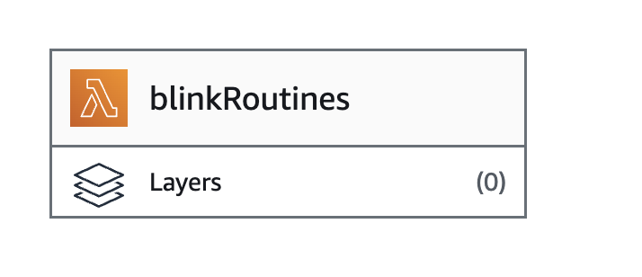

# blinkRoutines

Based on the repositiory of [MattTW](https://github.com/MattTW/BlinkMonitorProtocol) where is listened the API of the Blink Cameras, this is an API that you can deploy in AWS for been able to arm or disarm your cameras based in your GPS Position. For this, Im using Samsung Routines that allows to open a page based in your location.

Here you will have the process for doing it for your self.

# AWS Function deployment

## Download the code

The first thing that you must do is download this repository. For this you can execute this command

```
git clone https://github.com/mpedreira/blinkRoutines.git
```

## Create a new layer

Once you have the code, next step is to create the layer for the libraries that we want to use. They are defined in requirements.txt and you can create it with the following command:

```
mkdir python
pip3 install --platform x86_64 --target python -r blinkRoutines/requirements.txt --python-version 3.12 --only-binary :all:
zip -r9 blinkRoutines-layer.zip python
```

## Create ZIP of the APP

You also need to create a zip file with the app content. For that, you can execute this code:

```
cd blinkRoutines
zip -r9 ../my_app.zip app
```

## Deploy new layer in AWS

In the layers page inside functions in AWS, you will need to create a new layer with the layers required by this project that you can see in the image above


Once there, you will need to press in Create layer with this configuration:


With this new blinkRoutines_Layer you can config the new lambda

## Deploy the function

For creating this lambda, you must config the lambda from scratch with this configuration


## Upload the code

Pressing in the box Upload Zip File


And select the file generated in the previous phase


## Add the Layer

Once created, you must include the layer previously created. For that, you must press in layers



And there select custom layers --> blinkRoutines_Layer -> v1 with a configuration like the next image


## Change the function handler

As far as we are not using the default handler, we must change it over the function configuration.
New handler must be app.main.handler as you can see above


## Create Variables

For now they are not very importants because you will need to overwrite most of them but you have to create these variables

| Nombre         | Valor                               |
| -------------- | ----------------------------------- |
| TIER           | ANY                                 |
| ACCOUNT_ID     | ANY                                 |
| TOKEN_AUTH     | ANY                                 |
| ENDPOINT_BLINK | https://rest-prod.immedia-semi.com/ |
| TIMEOUT        | 3                                   |


## TO DO API GATEWAY AND BASIC CONF ##
